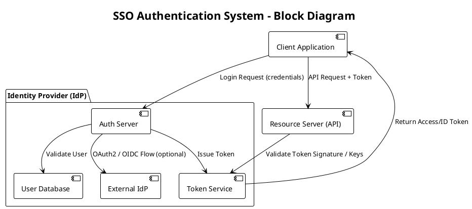
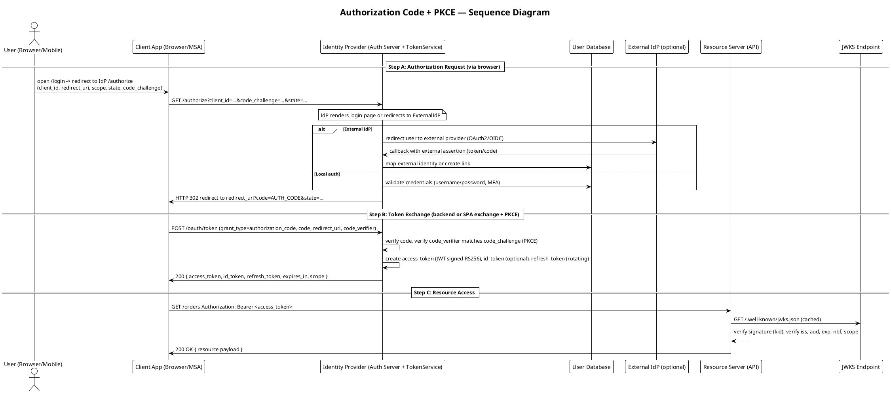
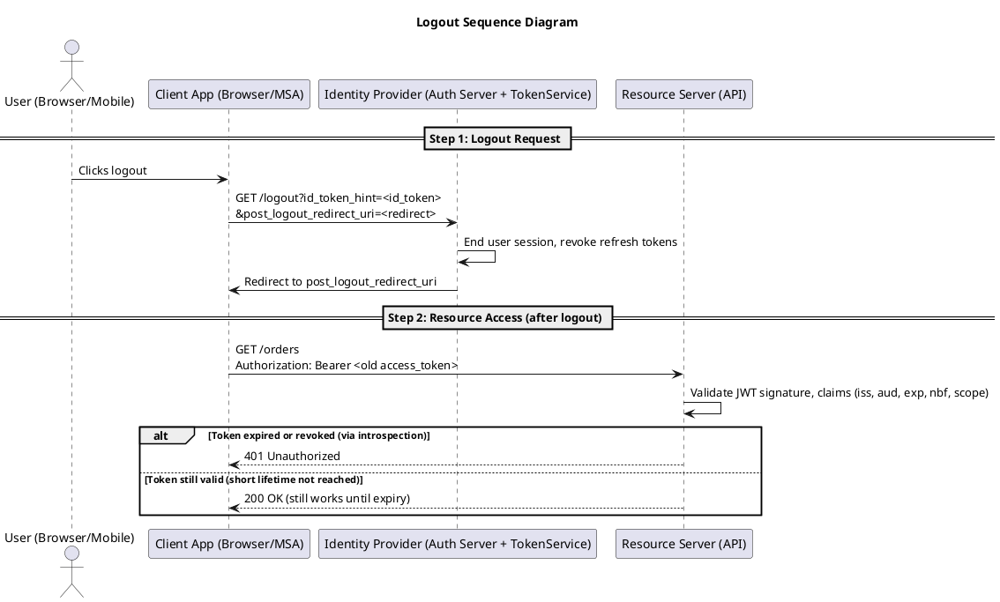
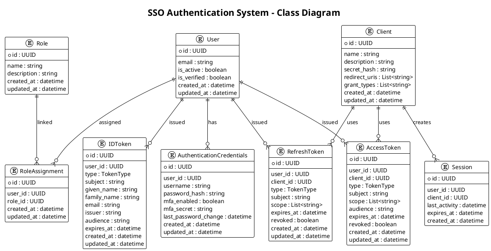

🔑 Authentication
===

> *This is a live document and will be updated as the system evolves.*

🌐 Overview
---

This module aims to provide a robust authentication mechanism for many applications through a Single Sign-On (SSO) approach, leveraging industry standards such as OAuth2 and OpenID Connect (OIDC).

The scope of this module includes user authentication and registration, as well as token management and validation.

> This will be entirely developed for the personal usage of the author on many of their projects, any external usage is welcome but not officially supported.

This module will be built with extensibility in mind, allowing for future enhancements and integrations as needed.

💻 The System
---

The Single Sign-On (SSO) system is designed to streamline user authentication by enabling users to access multiple applications with a single set of credentials. It operates by centralizing the authentication process, ensuring secure and seamless access across integrated systems. The system leverages OAuth2 and OpenID Connect (OIDC) protocols to provide secure token-based authentication, ensuring compliance with modern security standards. Key components include an authentication server, token issuance and validation mechanisms, and support for extensible integrations to accommodate future needs.

- 🎯 **Goals**
  - Simplify user authentication across multiple applications
  - Enhance security through centralized token management
  - Support for modern authentication standards (OAuth2, OIDC)
  - Provide a seamless user experience with single sign-on capabilities
  - Enable easy integration with existing applications and services

- ❌ **Non-Goals**
  - Implementing a full-fledged user management system
  - Supporting legacy authentication protocols
  - Providing extensive user interface components

- 🚉 **Supported Platforms**
  - Web applications (SPA, MPA)

> For now, only web applications are planned to be supported.

✅ Requirements
---

- 🦾 **Functional Requirements**
  - User authentication and registration via Identity Providers (IdP)
  - Token issuance and validation (JWT, OAuth2 tokens)
  - Support for OAuth2 and OIDC protocols
  - Session management and logout flows
  - Centralized token management
  - Password management (reset, complexity requirements), MFA, account recovery
  - Integration with external identity providers (e.g., Google, Facebook)

- ⚙️ **Non-Functional Requirements**
  - High availability and reliability
  - Scalability to support a growing number of users
  - Compliance with security standards and best practices
  - Performance optimization for low-latency authentication

🏠 Architecture
---

The stack consists of a frontend application (React) to render the Login and Registration pages, and a backend API (Python + FastAPI) to handle authentication requests and user management.

- 👨‍💻 **Stack**
  - 🖥️ Frontend: *React*
    > React was chosen as the frontend framework for its component-based architecture, which promotes reusability and maintainability. Moreover, it has a rich ecosystem of libraries and tools that facilitate development and enhance user experience.
  - ⚙️ Backend: *Python + FastAPI*
    > FastAPI was selected for its high performance, ease of use, and automatic generation of OpenAPI documentation. It allows for rapid development of RESTful APIs with built-in support for data validation and serialization.
  - 🗄️ Database: *PostgreSQL*
    > PostgreSQL was chosen for its robustness, scalability, and support for advanced data types. It provides a reliable and efficient storage solution for user data and authentication tokens.
  - 🔒 Auth: *OAuth2 + OpenID Connect*
    > OAuth2 and OpenID Connect were selected for their industry-standard protocols for authorization and authentication. They provide a secure and flexible framework for managing user identities and access tokens.
  - 🧪 Testing: *Pytest + React Testing Library*
    > These tools were chosen for their ease of use and ability to facilitate comprehensive testing of both frontend and backend components.
  - 📝 Linter: *Pylint + ESLint*
    > These tools were selected to enforce coding standards and best practices across the codebase, helping to maintain code quality and consistency.
  - 🛠️ Formatter: *Prettier*
    > Prettier was chosen for its opinionated code formatting capabilities, ensuring a consistent code style across the frontend codebase.
  - 📦 Package Manager: *pip + npm*
    > Pip is used for managing Python packages, while npm is used for managing JavaScript packages. This combination allows for efficient dependency management across the entire stack.
  - 🚀 Deployment: *Docker + Kubernetes*
    > Docker is used to containerize applications, ensuring consistent environments across development, testing, and production. Kubernetes is used for orchestrating and managing containerized applications at scale.
  - ✅ CI/CD: *GitHub Actions*
    > GitHub Actions is used to automate the CI/CD pipeline, enabling continuous integration and deployment of the application.
  - 📜 Documentation: *Markdown + PlantUML*
    > Markdown is used for writing documentation, while PlantUML is used for creating diagrams and visual representations of the system architecture. They both keep the documentation living and up-to-date with the codebase.
  - 🔒 Security: *OWASP Top Ten + SAST/DAST*
    > The OWASP Top Ten provides a comprehensive list of the most critical security risks to web applications, serving as a guideline for secure coding practices. SAST (Static Application Security Testing) and DAST (Dynamic Application Security Testing) tools are employed to identify vulnerabilities in the codebase and running applications, respectively.

Below is the block diagram for the SSO Authentication System:



- 📦 **Components and Responsibilities**
  - **Client Application**: Initiates authentication requests and handles user sessions.
  - **Authorization Server**: Issues access tokens and handles authorization flows.
  - **Identity Provider (IdP)**: Manages user identities, authentication, and token issuance.
  - **Token Service**: Issues and validates tokens (JWT, OAuth2).
  - **Resource Server (API)**: Protects resources and validates access tokens. They are the applications (APPs) that will integrate with the SSO system.
  - **User Database**: Stores user credentials and profiles.
  - **External Identity Providers**: Facilitates federated authentication (e.g., Google, Facebook, GitHub, etc.).

The sequence diagram below illustrates the typical flow of the Authorization Code Grant with PKCE (Proof Key for Code Exchange) in the SSO Authentication System:



The logout sequence diagram illustrates the flow of the logout process in the SSO Authentication System. It will support only APP-level logout, meaning the logout will only terminate the user session in the current application, not globally across all applications.



⛨ Security Considerations
---

- **Transport Security**: Enforce HTTPS for all communications to protect data in transit.
- **Password Handling**: Use strong hashing algorithms (e.g., bcrypt, Argon2) for storing passwords.
- **Token Format**: Use JWT (JSON Web Tokens) for access tokens, ensuring they are signed and optionally encrypted.
- **Session Management**: Implement secure session management practices, including short-lived access tokens and refresh tokens with rotation.
- **Logging and Monitoring**: Implement logging and monitoring to detect and respond to suspicious activities, such as failed login attempts and token misuse.
- **Protection against attacks**: Implement measures to protect against common attacks, such as CSRF, XSS, SQL injection, replay attacks, and brute force attacks.
- **Compliance**: Ensure compliance with relevant regulations and standards (e.g., GDPR, HIPAA) regarding user data protection and privacy.

🎛️ Data Model
---

Below we define some entities for the authentication system. Be aware that this is, again, a live document, and this could slightly differ of what will actually be implemented.

- 🔑 **Authentication Credentials Entity**

> The Authentication Credentials entity represents the user's credentials used for authentication, including username, password hash, and any additional factors (e.g., MFA).

```python
from dataclasses import dataclass
from uuid import UUID
from datetime import datetime

@dataclass
class AuthenticationCredentials:
    id: UUID
    user_id: UUID
    created_at: datetime
    updated_at: datetime
    username: str
    password_hash: str
    mfa_enabled: bool
    mfa_secret: str
    last_password_change: datetime
```

- 👨‍✈️ **Role Entity**

> The Role entity represents a role assigned to a user, defining their permissions and access levels within the system.

```python
from dataclasses import dataclass
from uuid import UUID
from datetime import datetime

@dataclass
class Role:
    id: UUID
    name: str
    description: str
    created_at: datetime
    updated_at: datetime
```

- 🔃 **Role Assignment Entity**

> The Role entities can be assigned to Users through a many-to-many relationship. This relationship is represented by the 'RoleAssignment' entity.

```python
from dataclasses import dataclass
from uuid import UUID
from datetime import datetime

@dataclass
class RoleAssignment:
    id: UUID
    user_id: UUID
    role_id: UUID
    created_at: datetime
    updated_at: datetime
```

- 👤 **User Entity**

> The User entity represents the user in the system and contains personal information, authentication credentials, and metadata. This is the aggregate root for user-related data.

```python
from dataclasses import dataclass
from typing import List, Optional
from uuid import UUID
from datetime import datetime

@dataclass
class User:
    id: UUID
    authentication_credentials: AuthenticationCredentials
    email: str
    is_active: bool
    is_verified: bool
    created_at: datetime
    updated_at: datetime
    role_assignments: List[RoleAssignment]
```

- 🧩 **Token Type Enum**

> The Token Type Enum defines the various types of tokens used in the system, such as access tokens, refresh tokens, and ID tokens.

```python
from enum import Enum

class TokenType(str, Enum):
    BEARER = "bearer"
```

- 🎟️ **Access Token Entity**

> The Access Token entity represents a short-lived credential that allows the client to access protected resources on behalf of the user.

```python
from dataclasses import dataclass
from uuid import UUID
from datetime import datetime
from typing import List

@dataclass
class AccessToken:
    id: UUID
    user_id: UUID
    client_id: UUID
    created_at: datetime
    updated_at: datetime
    revoked: bool
    type: TokenType
    subject: str
    scope: List[str]
    audience: str
    expires_at: datetime
  ```

- 🔄 **Refresh Token Entity**

> The Refresh Token entity represents a long-lived credential that can be used to obtain new access tokens without requiring the user to re-authenticate.

```python
from dataclasses import dataclass
from uuid import UUID
from datetime import datetime

@dataclass
class RefreshToken:
    id: UUID
    user_id: UUID
    created_at: datetime
    updated_at: datetime
    revoked: bool
    type: TokenType
    subject: str
    client_id: UUID
    scope: List[str]
    expires_at: datetime
```

- 🎫 **ID Token Entity (OIDC)**

> The ID Token entity represents the identity of the user and is used in OpenID Connect (OIDC) for authentication.

```python
from dataclasses import dataclass
from uuid import UUID
from datetime import datetime

@dataclass
class IDToken:
    id: UUID
    user_id: UUID
    created_at: datetime
    updated_at: datetime
    type: TokenType
    subject: str
    given_name: str
    family_name: str
    email: str
    issuer: str
    audience: str
    expires_at: datetime
```

- 💻 **Client Entity**

> The Client entity represents an application or service that interacts with the authentication system, typically on behalf of a user.

```python
from dataclasses import dataclass
from uuid import UUID
from datetime import datetime
from typing import List

@dataclass
class Client:
    id: UUID
    name: str
    description: str
    secret_hash: str
    redirect_uris: List[str]
    grant_types: List[str]
    created_at: datetime
    updated_at: datetime
```

- 🖥️ **Session Entity**

> The Session entity represents a user session, tracking the user's activity and session expiration.

```python
from dataclasses import dataclass
from uuid import UUID
from datetime import datetime

@dataclass
class Session:
    id: UUID
    user_id: UUID
    client_id: UUID
    created_at: datetime
    last_activity: datetime
    expires_at: datetime
```



📊 **Database Schema**

Below is the proposed database schema for the SSO Authentication System. It captures the relationships and entities described earlier.

𝌏 **Tables**

1 . **users**

- `id` (UUID, Primary Key)
- `email` (VARCHAR, Unique, Not Null)
- `is_active` (BOOLEAN, Default: True)
- `is_verified` (BOOLEAN, Default: False)
- `created_at` (TIMESTAMP, Default: CURRENT_TIMESTAMP)
- `updated_at` (TIMESTAMP, Default: CURRENT_TIMESTAMP)

2 . **authentication_credentials**

- `id` (UUID, Primary Key)
- `user_id` (UUID, Foreign Key -> users.id, Not Null)
- `username` (VARCHAR, Unique, Not Null)
- `password_hash` (VARCHAR, Not Null)
- `mfa_enabled` (BOOLEAN, Default: False)
- `mfa_secret` (VARCHAR, Nullable)
- `last_password_change` (TIMESTAMP, Nullable)
- `created_at` (TIMESTAMP, Default: CURRENT_TIMESTAMP)
- `updated_at` (TIMESTAMP, Default: CURRENT_TIMESTAMP)

3 . **roles**

- `id` (UUID, Primary Key)
- `name` (VARCHAR, Unique, Not Null)
- `description` (TEXT, Nullable)
- `created_at` (TIMESTAMP, Default: CURRENT_TIMESTAMP)
- `updated_at` (TIMESTAMP, Default: CURRENT_TIMESTAMP)

4 . **role_assignments**

- `id` (UUID, Primary Key)
- `user_id` (UUID, Foreign Key -> users.id, Not Null)
- `role_id` (UUID, Foreign Key -> roles.id, Not Null)
- `created_at` (TIMESTAMP, Default: CURRENT_TIMESTAMP)
- `updated_at` (TIMESTAMP, Default: CURRENT_TIMESTAMP)

5 . **clients**

- `id` (UUID, Primary Key)
- `name` (VARCHAR, Unique, Not Null)
- `description` (TEXT, Nullable)
- `secret_hash` (VARCHAR, Not Null)
- `redirect_uris` (JSONB, Not Null)
- `grant_types` (JSONB, Not Null)
- `created_at` (TIMESTAMP, Default: CURRENT_TIMESTAMP)
- `updated_at` (TIMESTAMP, Default: CURRENT_TIMESTAMP)

6 . **access_tokens**

- `id` (UUID, Primary Key)
- `user_id` (UUID, Foreign Key -> users.id, Not Null)
- `client_id` (UUID, Foreign Key -> clients.id, Not Null)
- `type` (VARCHAR, Not Null)
- `subject` (VARCHAR, Not Null)
- `scope` (JSONB, Not Null)
- `audience` (VARCHAR, Not Null)
- `expires_at` (TIMESTAMP, Not Null)
- `revoked` (BOOLEAN, Default: False)
- `created_at` (TIMESTAMP, Default: CURRENT_TIMESTAMP)
- `updated_at` (TIMESTAMP, Default: CURRENT_TIMESTAMP)

7 . **refresh_tokens**

- `id` (UUID, Primary Key)
- `user_id` (UUID, Foreign Key -> users.id, Not Null)
- `client_id` (UUID, Foreign Key -> clients.id, Not Null)
- `type` (VARCHAR, Not Null)
- `subject` (VARCHAR, Not Null)
- `scope` (JSONB, Not Null)
- `expires_at` (TIMESTAMP, Not Null)
- `revoked` (BOOLEAN, Default: False)
- `created_at` (TIMESTAMP, Default: CURRENT_TIMESTAMP)
- `updated_at` (TIMESTAMP, Default: CURRENT_TIMESTAMP)

8 . **id_tokens**

- `id` (UUID, Primary Key)
- `user_id` (UUID, Foreign Key -> users.id, Not Null)
- `type` (VARCHAR, Not Null)
- `subject` (VARCHAR, Not Null)
- `given_name` (VARCHAR, Nullable)
- `family_name` (VARCHAR, Nullable)
- `email` (VARCHAR, Nullable)
- `issuer` (VARCHAR, Not Null)
- `audience` (VARCHAR, Not Null)
- `expires_at` (TIMESTAMP, Not Null)
- `created_at` (TIMESTAMP, Default: CURRENT_TIMESTAMP)
- `updated_at` (TIMESTAMP, Default: CURRENT_TIMESTAMP)

9 . **sessions**

- `id` (UUID, Primary Key)
- `user_id` (UUID, Foreign Key -> users.id, Not Null)
- `client_id` (UUID, Foreign Key -> clients.id, Not Null)
- `last_activity` (TIMESTAMP, Not Null)
- `expires_at` (TIMESTAMP, Not Null)
- `created_at` (TIMESTAMP, Default: CURRENT_TIMESTAMP)

🔃 **Relationships**

- `users` ↔ `authentication_credentials`: One-to-One
- `users` ↔ `role_assignments`: One-to-Many
- `roles` ↔ `role_assignments`: One-to-Many
- `users` ↔ `access_tokens`: One-to-Many
- `users` ↔ `refresh_tokens`: One-to-Many
- `users` ↔ `id_tokens`: One-to-Many
- `clients` ↔ `access_tokens`: One-to-Many
- `clients` ↔ `refresh_tokens`: One-to-Many
- `clients` ↔ `sessions`: One-to-Many
- `users` ↔ `sessions`: One-to-Many
- `clients` ↔ `users`: Many-to-Many (via `sessions`)
- `roles` ↔ `users`: Many-to-Many (via `role_assignments`)
- `access_tokens` ↔ `refresh_tokens`: Optional linkage for token rotation.

This schema ensures scalability, security, and compliance with modern authentication standards.

∫ Integration
---

The system will expose RESTful APIs for managing users, roles, and authentication tokens. The API will include endpoints for:

- User registration and management
- Role assignment and management
- Token issuance and revocation
- Client management

All API requests will be authenticated using OAuth 2.0, and responses will be in JSON format.

- **User Registration and Management**
  - `POST /users`: Register a new user
  - `GET /users`: List all users
  - `GET /users/{id}`: Retrieve user information
  - `PUT /users/{id}`: Update user information
  - `POST /users/{id}/password`: Update user password
  - `POST /users/{id}/password/reset`: Reset user password
  - `POST /users/{id}/mfa`: Enable multi-factor authentication for a user
  - `POST /users/{id}/mfa/revoke`: Disable multi-factor authentication for a user

- **Role Assignment and Management**
  - `POST /users/{id}/roles`: Assign a role to a user
  - `DELETE /users/{id}/roles/{roleId}`: Remove a role from a user
  - `GET /users/{id}/roles`: List all roles assigned to a user

- **Token Issuance and Revocation**
  - `POST /oauth/token`: issue or refresh tokens (grant types: password, client_credentials, refresh_token, authorization_code)
  - `POST /oauth/revoke`: Revoke a token
  - `POST /oauth/introspect`: Introspect a token

- **Client Management**
  - `POST /clients`: Register a new client
  - `GET /clients`: List all clients
  - `GET /clients/{id}`: Retrieve client information
  - `PUT /clients/{id}`: Update client information
  - `DELETE /clients/{id}`: Delete a client
  - `POST /clients/{id}/rotate`: Rotate client secret

- **OpenID Connect**
  - `GET /.well-known/openid-configuration`: Retrieve OIDC configuration
  - `GET /.well-known/jwks.json`: Retrieve JSON Web Key Set (JWKS) for token verification
  - `GET /userinfo`: Retrieve user information using an access token

The project will also provide a python and javascript SDK for easier integration with the authentication system of your applications.

Finally, the system will aim to integrate third-party identity providers using the OAuth 2.0 and OpenID Connect protocols, allowing users to authenticate using their existing accounts from providers like Google, Facebook, and others.

🚀 Deployment and Infrastructure
---

- **Environment Setup**: The system will be divided and deployed into three main environments: development, staging, and production. Each environment will have its own configuration settings, databases, and resources to ensure isolation and security.
- **Containerization**: The application will be containerized using Docker, allowing for consistent environments across development, testing, and production. Docker Compose will be used to define and run multi-container applications, including the API server, database, and any other required services.
- **Monitoring and Logging**: The system will implement centralized logging and monitoring using tools like ELK Stack (Elasticsearch, Logstash, Kibana) or Grafana. This will help in tracking user activity, identifying issues, and ensuring the overall health of the application.
- **Backup and Recovery**: The system will implement regular backup and recovery procedures to ensure data integrity and availability. Backups will be stored securely and tested regularly to ensure they can be restored in case of data loss or corruption.

🧪 Testing Strategy
---

The project will follow the Test Driven Development (TDD) principles, ensuring that tests are written before the actual code implementation. This approach will help in maintaining high code quality, facilitating refactoring, and ensuring that the system meets the specified requirements.

- ***Steps of TDD***
  - 🔴 **Red**: Write a failing test case that defines the desired functionality.
  - 🟢 **Green**: Write the minimum code necessary to make the test pass.
  - 🔄 **Refactor**: Refactor the code while keeping the tests green.

- 1️⃣ **Unit Testing**: Each component will have its own set of unit tests to ensure individual functionality works as expected.
- ∫ **Integration Testing**: The system will include integration tests to verify that different components work together as intended.
- 🛡️ **Security Testing**: The system will implement security tests to identify vulnerabilities and ensure that user data is protected.
- 📈 **Performance Testing**: The system will include performance tests to ensure that it can handle the expected load and respond quickly to user requests.

⚙️ Operational Considerations
---

- **CI/CD Pipeline**
  > The project will implement a Continuous Integration and Continuous Deployment (CI/CD) pipeline using GitHub Actions. This pipeline will automate the testing, building, and deployment processes, ensuring that code changes are thoroughly tested and deployed to the appropriate environments seamlessly.
  
  ```plantuml
  @startuml
  title CI/CD Pipeline
  !theme plain

  [Formatter] -> [Linter]
  [Linter] -> [Build]
  [Build] -> [Unit Test]
  [Unit Test] -> [Integration Test]
  [Integration Test] -> [Security Test]
  [Security Test] -> [Performance Test]
  [Performance Test] -> [Deploy]
  
  @enduml
  ```
  
  ```plantuml
  @startuml
  title CI/CD Pipeline - Docker Image
  !theme plain

  [Change] -> [Build]
  [Build] -> [Publish]
  ```

- **Rollback Strategy**
  > In case of a failed deployment or critical issue in production, the system will implement a rollback strategy to revert to the last known good state. This will involve:
  - Automated rollback procedures in the CI/CD pipeline to quickly revert changes.
  - Maintaining versioned backups of the application and database to restore previous states.
  - Thorough testing of rollback procedures to ensure they work as intended.

📕 Glossary
---

This glossary provides definitions for all technical terms, acronyms, and concepts used throughout this document, organized alphabetically for easy reference.

- **A**

**Access Token**: A short-lived credential issued by the authorization server that grants the client application permission to access specific protected resources on behalf of the user. In this system, access tokens are implemented as JWTs with a limited lifespan for security.

**API (Application Programming Interface)**: A set of protocols, routines, and tools that allows different software applications to communicate with each other. In this context, refers to the RESTful endpoints exposed by the authentication system.

**APP-level Logout**: A logout mechanism that terminates the user session only within the current application, as opposed to a global logout that would terminate sessions across all integrated applications.

**Argon2**: A modern, secure password hashing algorithm designed to be resistant to various attacks including brute force and rainbow table attacks. Considered one of the best practices for password storage.

**Authorization Code Grant**: An OAuth 2.0 flow where the client receives an authorization code that is later exchanged for an access token. This is considered the most secure flow for web applications.

**Authorization Server**: A server that issues access tokens to clients after successfully authenticating the resource owner and obtaining authorization. In this system, it's part of the Identity Provider.

**Audience (aud)**: A JWT claim that identifies the recipients that the JWT is intended for. Each principal intended to process the JWT must identify itself with a value in the audience claim.

- **B**

**bcrypt**: A password hashing function designed to be computationally expensive to make brute force attacks impractical. Uses adaptive hashing with configurable work factor.

**Bearer Token**: A type of access token that grants access to resources simply by possessing the token, without requiring cryptographic proof of identity.

- **C**

**CI/CD (Continuous Integration/Continuous Deployment)**: A development practice that involves automatically testing, building, and deploying code changes through automated pipelines.

**Client**: An application that requests access to protected resources on behalf of a user. In OAuth 2.0, clients can be public (like SPAs) or confidential (like server-side applications).

**Client Credentials Grant**: An OAuth 2.0 flow used when the client is requesting access to protected resources under its control, not on behalf of a user.

**Code Challenge**: Part of the PKCE extension, a cryptographically random string generated by the client and sent with the authorization request.

**Code Verifier**: Part of the PKCE extension, the original random string that corresponds to the code challenge, sent during token exchange to prove the client's identity.

**CSRF (Cross-Site Request Forgery)**: A type of malicious exploit where unauthorized commands are transmitted from a user that the web application trusts.

- **D**

**DAST (Dynamic Application Security Testing)**: Security testing performed on running applications to identify vulnerabilities that manifest during runtime.

**Docker**: A containerization platform that packages applications and their dependencies into lightweight, portable containers.

**Docker Compose**: A tool for defining and running multi-container Docker applications using YAML configuration files.

- **E**

**ELK Stack**: A collection of three open-source tools - Elasticsearch (search engine), Logstash (data processing pipeline), and Kibana (data visualization) - used for centralized logging and monitoring.

**ESLint**: A static code analysis tool for identifying problematic patterns in JavaScript code and enforcing coding standards.

**External Identity Provider (External IdP)**: Third-party authentication services (like Google, Facebook, GitHub) that can authenticate users on behalf of the system through federated authentication.

- **F**

**FastAPI**: A modern, fast web framework for building APIs with Python based on standard Python type hints, featuring automatic API documentation generation.

**Federated Authentication**: A system that allows users to use a single set of credentials to access multiple applications or services across different domains.

- **G**

**GDPR (General Data Protection Regulation)**: European regulation that governs data protection and privacy for individuals within the European Union.

**GitHub Actions**: A CI/CD platform integrated with GitHub that allows automation of software development workflows.

**Grant Types**: Different OAuth 2.0 flows that define how a client can obtain an access token (e.g., authorization code, client credentials, refresh token).

**Grafana**: An open-source platform for monitoring and observability that provides dashboards and alerting capabilities.

- **H**

**HIPAA (Health Insurance Portability and Accountability Act)**: US legislation that provides data privacy and security provisions for safeguarding medical information.

**HTTPS**: Secure version of HTTP that uses SSL/TLS encryption to protect data in transit between client and server.

- **I**

**ID Token**: A JWT token used in OpenID Connect that contains identity information about the user, such as their name, email, and other profile data.

**Identity Provider (IdP)**: A service that creates, maintains, and manages identity information for users and provides authentication services to relying party applications.

**Issuer (iss)**: A JWT claim that identifies the principal that issued the JWT, typically the authorization server's URL.

- **J**

**JWT (JSON Web Token)**: A compact, URL-safe means of representing claims between two parties. Consists of three parts: header, payload, and signature.

**JWKS (JSON Web Key Set)**: A set of keys containing the public keys used to verify JWTs issued by the authorization server.

- **K**

**Kid (Key ID)**: A hint indicating which key was used to secure the JWT, typically found in the JWT header and used to identify the correct key from a JWKS.

**Kubernetes**: An open-source container orchestration platform for automating deployment, scaling, and management of containerized applications.

- **M**

**MFA (Multi-Factor Authentication)**: A security method that requires users to provide two or more verification factors to gain access to a resource.

**MPA (Multi-Page Application)**: A traditional web application that loads entire new pages from the server for each user interaction.

**MSA (Mobile/Single-page Application)**: Applications that run on mobile devices or single-page web applications that dynamically update content without full page reloads.

- **N**

**NBF (Not Before)**: A JWT claim that identifies the time before which the JWT must not be accepted for processing.

**npm**: The default package manager for Node.js, used for installing and managing JavaScript dependencies.

- **O**

**OAuth 2.0**: An authorization framework that enables applications to obtain limited access to user accounts without exposing user credentials.

**OIDC (OpenID Connect)**: An identity layer built on top of OAuth 2.0 that allows clients to verify user identity and obtain basic profile information.

**OWASP Top Ten**: A list of the ten most critical web application security risks, published by the Open Web Application Security Project.

- **P**

**Password Grant**: An OAuth 2.0 flow where the client directly exchanges user credentials for an access token (deprecated for security reasons).

**pip**: The standard package manager for Python, used for installing and managing Python packages.

**PKCE (Proof Key for Code Exchange)**: An OAuth 2.0 security extension designed to protect against authorization code interception attacks, especially for public clients.

**PlantUML**: A tool that allows users to create UML diagrams from plain text descriptions.

**PostgreSQL**: An open-source relational database management system known for its robustness and support for advanced data types.

**Prettier**: An opinionated code formatter that enforces consistent code style across JavaScript/TypeScript codebases.

**Pylint**: A static code analysis tool for Python that checks for errors, enforces coding standards, and suggests improvements.

**Pytest**: A testing framework for Python that makes it easy to write simple and scalable test cases.

- **R**

**React**: A JavaScript library for building user interfaces, particularly single-page applications where data changes over time.

**React Testing Library**: A testing utility that provides simple and complete testing utilities for React components.

**Refresh Token**: A long-lived credential used to obtain new access tokens without requiring user re-authentication.

**Resource Server**: A server hosting protected resources that accepts and responds to protected resource requests using access tokens.

**RS256**: An asymmetric algorithm that uses RSA with SHA-256 for JWT signing, providing enhanced security through public/private key pairs.

- **S**

**SAST (Static Application Security Testing)**: Security testing performed on source code to identify potential vulnerabilities before the application runs.

**Scope**: A parameter that defines the level of access that an access token grants to a client application.

**SDK (Software Development Kit)**: A collection of software development tools that allows developers to create applications for specific platforms or services.

**Session**: A server-side storage of information about a user's interaction with the application, typically lasting from login to logout.

**SPA (Single-Page Application)**: A web application that loads a single HTML page and dynamically updates content as the user interacts with the app.

**SQL Injection**: A type of security vulnerability where malicious SQL code is inserted into application queries to manipulate the database.

**SSO (Single Sign-On)**: An authentication mechanism that allows users to access multiple applications with a single set of credentials.

**Subject (sub)**: A JWT claim that identifies the principal that is the subject of the JWT, typically the user ID.

- **T**

**TDD (Test Driven Development)**: A software development methodology where tests are written before the actual code implementation.

**Token Introspection**: An OAuth 2.0 extension that allows resource servers to query the authorization server about the current state of an access token.

**Token Revocation**: The process of invalidating an access or refresh token before its natural expiration time.

**Token Rotation**: A security practice where refresh tokens are replaced with new ones each time they are used to obtain new access tokens.

**TLS (Transport Layer Security)**: A cryptographic protocol that provides secure communication over a network, successor to SSL.

- **U**

**UUID (Universally Unique Identifier)**: A 128-bit number used to uniquely identify information in computer systems without requiring a central coordinating authority.

- **W**

**Well-known Endpoint**: A standardized URL where clients can discover information about an OAuth 2.0/OIDC provider's configuration and capabilities.

- **X**

**XSS (Cross-Site Scripting)**: A type of security vulnerability where malicious scripts are injected into trusted websites and executed in users' browsers.

🌐 References
---

- [OAuth 2.0 Framework](https://datatracker.ietf.org/doc/html/rfc6749): The official specification for the OAuth 2.0 authorization framework.
- [OpenID Connect Core 1.0](https://openid.net/specs/openid-connect-core-1_0.html): The official specification for OpenID Connect, built on top of OAuth 2.0.
- [OAuth 2.0 Best Current Practice](https://datatracker.ietf.org/doc/html/rfc8252): Recommendations for using OAuth 2.0 securely, including PKCE.
- [JSON Web Tokens (JWT)](https://datatracker.ietf.org/doc/html/rfc7519): The specification for JSON Web Tokens, commonly used in OAuth 2.0 and OIDC.
- [OAuth 2.0 Threat Model and Security Considerations](https://datatracker.ietf.org/doc/html/rfc6819): A detailed analysis of potential threats and mitigations for OAuth 2.0.
- [OpenID Connect Discovery](https://openid.net/specs/openid-connect-discovery-1_0.html): Defines how clients dynamically discover information about OpenID Providers.
- [OAuth 2.0 Token Revocation](https://datatracker.ietf.org/doc/html/rfc7009): The specification for revoking OAuth 2.0 tokens.
- [OAuth 2.0 Token Introspection](https://datatracker.ietf.org/doc/html/rfc7662): Defines a method for resource servers to query the authorization server about the validity of a token.
- [Proof Key for Code Exchange (PKCE)](https://datatracker.ietf.org/doc/html/rfc7636): An extension to OAuth 2.0 to improve security for public clients.
- [OpenID Connect Session Management](https://openid.net/specs/openid-connect-session-1_0.html): Defines how to manage user sessions in OpenID Connect.
- [OWASP Top Ten](https://owasp.org/www-project-top-ten/): A list of the most critical web application security risks.
